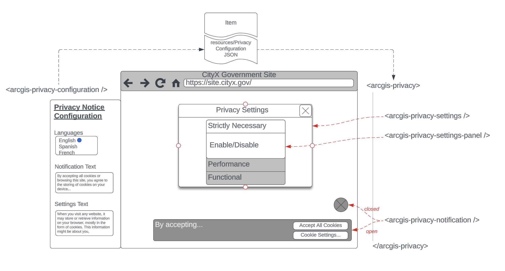

## ArcGIS Privacy Components 

This repository includes components for supporting configurable privacy settings in ArcGIS products. 

### Usage

1. Install the components
1. Include in your View HTML `<arcgis-privacy />`
1. Include in your editor HTML `<arcgis-privacy-configuration />`

### Design

